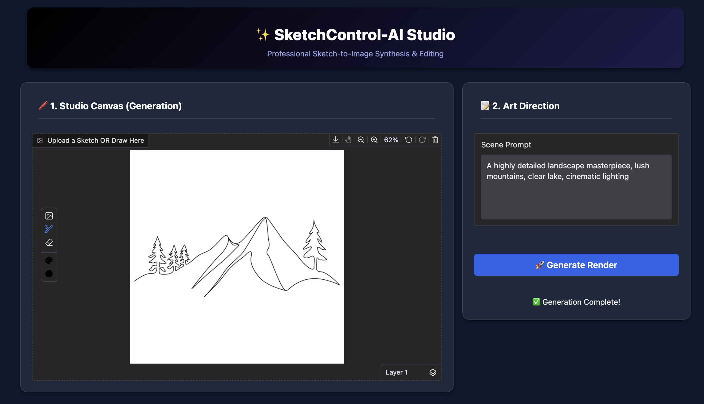
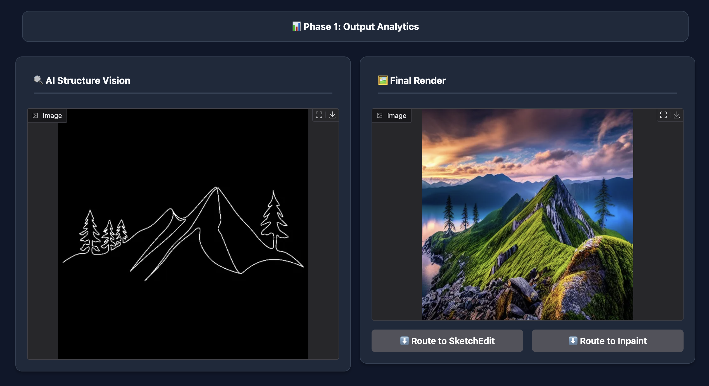
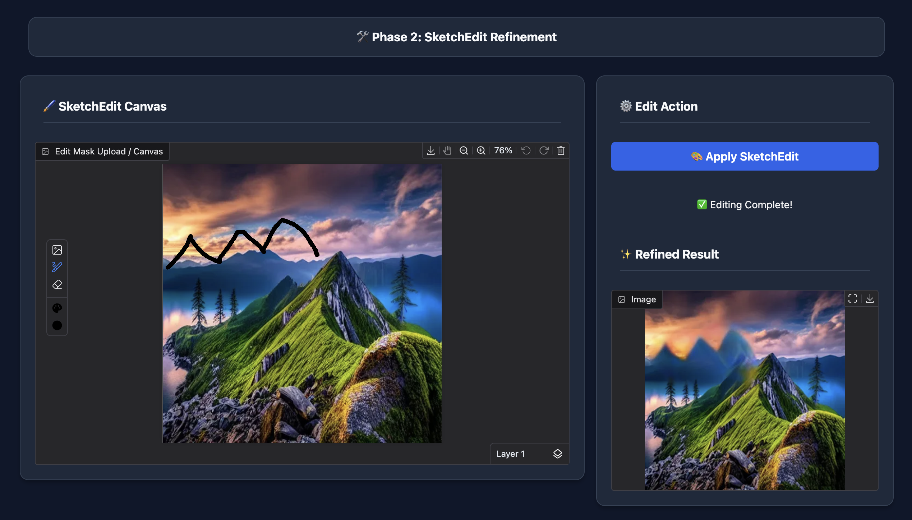
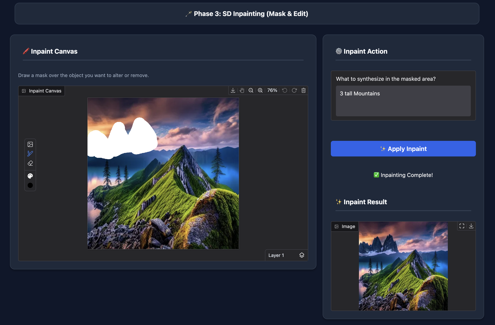
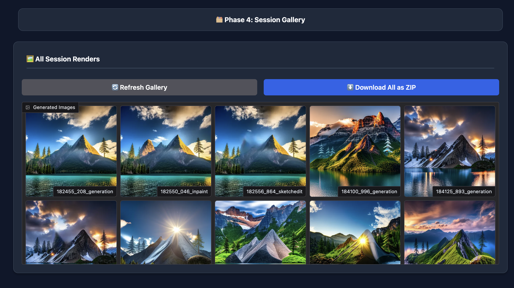

# SketchControl-AI Studio 🎨

**An Interactive Multi-Stage Framework for Sketch-Guided Image Generation and Local Editing**

SketchControl-AI Studio is a unified, multi-stage generative UI that allows users to create highly detailed base images from rough sketches, and iteratively refine them using two distinct editing paradigms: Mask-Free Structural Editing and Mask-Based Contextual Inpainting. 

By bridging modern HuggingFace `diffusers` logic with isolated CVPR research repositories via secure subprocess sandboxing, this tool provides a seamless, memory-managed state machine for creative image workflows.

---

## 🚀 The Pipeline (How It Works)

The studio operates in four distinct phases:

### Phase 1: Base Generation (ControlNet + SD 1.5)
* **Model:** Stable Diffusion v1.5 + `control_v11p_sd15_scribble`.
* **Process:** Acts as a strict architect. Users draw a rough concept sketch and provide a text prompt. ControlNet locks the synthesized image strictly to the contours drawn on the canvas, ensuring the generated scene fits the user's structural blueprint.

### Phase 2: Mask-Free Refinement (SketchEdit)
* **Model:** DeepFill-v2 GAN (optimized for the `Places2` dataset).
* **Process:** For structural modifications. Users draw partial structural lines directly over the generated base image. The model automatically predicts the target modification region without requiring tedious explicit masks, and seamlessly integrates the new structure into the scene.

### Phase 3: Mask-Based Contextual Editing (SD Inpainting)
* **Model:** RunwayML `Stable-Diffusion-Inpainting`.
* **Process:** For prompt-driven content replacement. Users explicitly mask a region and provide a secondary text prompt (e.g., "Add a glowing red crystal"). The pipeline alters specific objects while maintaining the global lighting and context of the original scene.

### Phase 4: Session Gallery
* A state management utility that saves all intermediate and final renders directly to a local gallery, allowing users to track their iterative design process and download their entire session history as a ZIP file.

---

## ⚖️ Mask-Free vs. Mask-Based Approach

Our framework gives users the freedom to choose the right tool for the specific edit they want to make:

| Feature | Phase 2: SketchEdit (Mask-Free) | Phase 3: SD Inpainting (Mask-Based) |
| :--- | :--- | :--- |
| **Input Required** | Structural Sketch Strokes | Explicit Bounding Mask + Text Prompt |
| **Best Used For** | Changing architecture, modifying terrain, adding structural shapes. | Adding specific objects, changing textures, contextual replacements. |
| **How it Works** | Automatically infers the edit region based on sketch contours. | Prioritizes unmasked surrounding pixels to blend in new text-prompt concepts. |

---

## 🖼️ Demo & Visual Results

Below are the visual outputs representing the step-by-step pipeline from initial sketch to final refined image.

### 1. Base Generation
The model successfully constrains the text prompt within the boundaries of the user's raw sketch.

  
  

### 2. SketchEdit Refinement
The user draws partial structural lines over the base image. The mask-free DeepFill-v2 GAN predicts the region and seamlessly integrates the new structure.

  

### 3. SD Inpainting
Using an explicit mask and a localized text prompt, the inpainting pipeline alters specific objects while maintaining global lighting.

  
  

---

## 🛠️ Repository Structure

* **`Part_3_Final_Inpainting_vs_SketchEdit/`**: Contains the main Jupyter Notebook/Colab file to run the complete, unified Gradio application.
* **`Demo_image/`**: Contains sample inputs and output results demonstrating the capabilities of the pipeline.

---

## 🧰 Tech Stack & Libraries

SketchControl-AI Studio leverages a modern Python deep learning stack alongside a reactive web frontend to handle heavy generative workloads smoothly.

### Core Frameworks & UI
* **Gradio:** Powers the interactive, dark-themed frontend web application, enabling the drawing canvas, custom CSS, and state management.
* **PyTorch:** The foundational machine learning framework driving all GPU-accelerated tensor operations and model inference.

### Generative AI & Diffusion Pipelines
* **HuggingFace Diffusers:** The backbone library managing the `StableDiffusionControlNetPipeline` and `StableDiffusionControlNetInpaintPipeline`.
* **Transformers:** Supports the underlying text-encoding and prompt-processing layers.
* **Stable Diffusion v1.5 & ControlNet:** Utilizes `runwayml/stable-diffusion-v1-5` and `lllyasviel/control_v11p_sd15_scribble` for the Phase 1 sketch-to-image generation.
* **DeepFill-v2 GAN (SketchEdit):** The specialized, mask-free local manipulation architecture, loaded via a secure Python subprocess wrapper.

### Image Processing & Utilities
* **Pillow (PIL):** Essential for dynamic mask extraction, alpha-channel manipulation, and handling user drawing layers (`Image`, `ImageDraw`, `ImageOps`).
* **NumPy & OpenCV (`cv2`):** Used for advanced array manipulations and image conversions between different model stages.

### Hardware Optimization
* **Accelerate & Xformers:** Deployed to drastically reduce VRAM consumption and speed up attention mechanisms (via FP16 optimizations) on CUDA GPUs.

---

## 💻 Installation & Usage

Because this pipeline integrates both `diffusers` (PyTorch) and the original SketchEdit implementation (which relies on specific environment dependencies), **Google Colab is highly recommended** to avoid local environment conflicts. 

1. Open the main notebook located in `Part_3_Final_Inpainting_vs_SketchEdit/`.
2. Ensure your Colab runtime is set to **T4 GPU** (or better).
3. Run the initial setup cells to clone the repositories and download the necessary weights (`places.pth`).
4. Execute the Gradio UI cell to launch the interactive dark-themed web application.

---

## 💡 Project Novelty & Architecture Highlights

* **Subprocess Sandboxing:** Bypassed complex dependency conflicts (like conflicting PyTorch versions between SD 1.5 and DeepFillv2) by executing SketchEdit via a secure Python subprocess wrapper.
* **Unified UI:** Consolidated disparate AI research repositories into a single, intuitive, memory-managed workflow.

---

